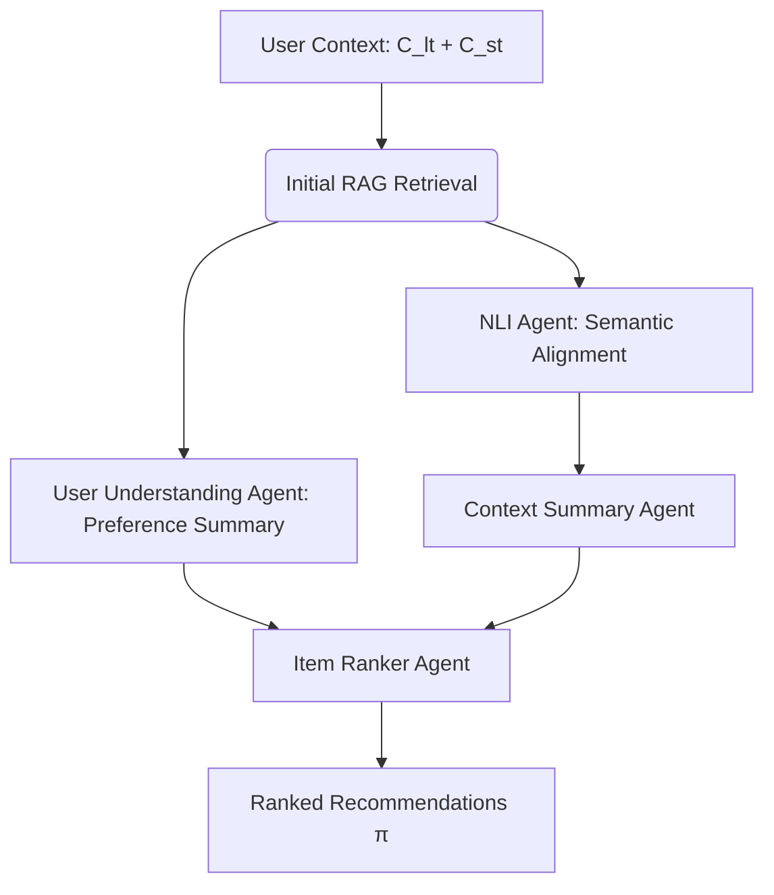

Below is a comprehensive Confluence documentation page summarizing the research paper **"ARAG: Agentic Retrieval Augmented Generation for Personalized Recommendation"** (arXiv:2506.21931v1). The content is structured for clarity, with key sections highlighted for technical audiences.

---

### **ARAG: Agentic Retrieval Augmented Generation for Personalized Recommendation**  
*Documentation Version 1.0 | Last Updated: 2025-07-01*  

---

### **1. Executive Summary**  
**ARAG** is an advanced recommendation framework that integrates **multi-agent collaboration** with Retrieval-Augmented Generation (RAG) to overcome limitations of traditional recommendation systems. By deploying specialized LLM-based agents, ARAG dynamically interprets user behavior, evaluates contextual alignment, and generates personalized recommendations. Experimental results show **42.1% improvement in NDCG@5** and **35.5% in Hit@5** compared to standard RAG baselines .  

---

### **2. Problem Statement**  
Traditional RAG-based recommendation systems face critical gaps:  
- **Static retrieval heuristics** fail to capture nuanced user preferences.  
- **Inflexible context integration** ignores dynamic session behavior.  
- **Semantic misalignment** between retrieved items and user intent .  

---

### **3. ARAG Framework Overview**  
ARAG introduces a pipeline of four specialized agents:  

| **Agent**               | **Function**                                                                 | **Input**                  | **Output**                |  
|-------------------------|-----------------------------------------------------------------------------|----------------------------|---------------------------|  
| User Understanding Agent | Summarizes long-term/session behavior into preferences                      | `long-term context (C_lt)`, `session context (C_st)` | Natural language summary  |  
| NLI Agent               | Evaluates semantic alignment of candidate items with inferred user intent    | Candidate item metadata    | Alignment score (`s_NLI`) |  
| Context Summary Agent   | Synthesizes NLI Agent findings into concise insights                        | NLI output                 | Contextual summary        |  
| Item Ranker Agent       | Generates final ranked recommendations based on contextual fit              | All agent outputs          | Ranked list (`π`)         |  

---

### **4. Workflow**  
1. **Initial Retrieval**:  
   - Embed user context `u = (C_lt, C_st)` and items into a shared space using `f_Emb`.  
   - Retrieve top-`k` candidate items `ℐ^0` via cosine similarity .  

2. **Agentic Processing**:  
   - **Step 1**: User Understanding Agent generates preference summary from `C_lt` and `C_st`.  
   - **Step 2**: NLI Agent scores each candidate item `i ∈ ℐ^0` for intent alignment using `s_NLI(i, u) = Φ(T(i), u)`.  
   - **Step 3**: Context Summary Agent distills NLI outputs.  
   - **Step 4**: Item Ranker Agent fuses signals to produce final ranking `π = f_Rank(u, ℐ)` .  

---

### **5. Key Innovations**  
- **Dynamic Intent Modeling**: Leverages session context for real-time preference adaptation.  
- **Semantic NLI Evaluation**: Uses natural language inference to reject irrelevant items.  
- **Collaborative Agent Framework**: Agents operate in tandem to refine relevance signals .  

---

### **6. Experimental Results**  
Tested across three datasets, ARAG outperforms benchmarks:  
- **↑42.1%** in NDCG@5 (measures ranking quality).  
- **↑35.5%** in Hit@5 (measures top-5 accuracy).  
- **Ablation Study**: Removing any agent degrades performance, confirming synergistic effects .  

---

### **7. Applications & Use Cases**  
- **E-commerce**: Personalize product recommendations using review metadata.  
- **Media Platforms**: Align video/music suggestions with session-specific behavior.  
- **Cold Start Mitigation**: Improve recommendations for new users via agentic context synthesis .  

---

### **8. References**  
- Full paper: [ARAG: Agentic Retrieval Augmented Generation for Personalized Recommendation](https://arxiv.org/html/2506.21931v1)  
- Conference: ACM SIGIR 2025, Padova, Italy .  

---  
*For implementation details or dataset specifics, consult Sections 2.2 and 3 of the source paper .*